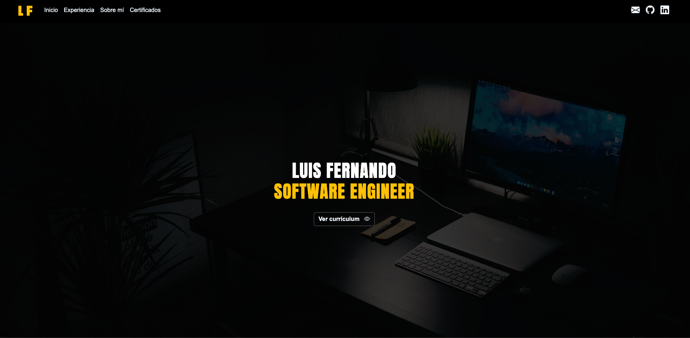

# 💼 Luis Fernando Rengifo - Portfolio

<div align="center">

[](https://react.dev)
[](https://vitejs.dev)
[](https://getbootstrap.com)
[](https://www.javascript.com)
[](https://pages.github.com)
[](LICENSE)

**Un portafolio web moderno, responsivo y optimizado construido con React y Vite.**

[🌐 Ver en vivo](https://luisruiz2000.github.io/Portafoliov1/) • [📧 Contactar](#-contacto) • [🚀 Empezar](#-instalación-y-uso-local)

</div>

---

## 📖 Descripción

Soy **Frontend Developer** con más de 3 años de experiencia desarrollando aplicaciones web empresariales. Este portafolio es una vitrina de mis habilidades técnicas, proyectos realizados y certificaciones profesionales en tecnologías modernas como **Angular**, **React** y **Vue**.

El sitio está optimizado para **performance**, **accesibilidad (WCAG 2.1)**, y **SEO**, con lazy loading en imágenes, variables CSS, y arquitectura escalable.

---

## ✨ Características Principales

- ✅ **Diseño responsivo** - Mobile-first adaptado a todos los dispositivos
- ⚡ **Optimización de performance** - Lazy loading, Google Fonts consolidadas, gzipped assets
- ♿ **Accesible** - WCAG 2.1 compliant con aria-labels y alt text descriptivos
- 🎨 **Tema oscuro profesional** - Interfaz moderna con colores personalizados
- 📊 **Secciones dinámicas** - Experiencia, proyectos y certificaciones renderizadas con .map()
- 🔐 **Seguro** - rel="noopener noreferrer" en enlaces externos
- 📱 **PWA-ready** - Preparado para evolucionar a Progressive Web App
- 🚀 **Construido con Vite** - Build time ultra-rápido y dev server con HMR

---

## 📸 Captura de Pantalla

<div align="center">



*Portfolio desplegado en GitHub Pages - [Ver en vivo](https://luisruiz2000.github.io/Portafoliov1/)*

</div>

---

## 🛠️ Tecnologías Utilizadas

### Frontend

| Tecnología | Versión | Descripción |
|-----------|---------|-------------|
|  | 18.2.0 | Librería para construir UIs con componentes |
|  | ES6+ | Lenguaje de programación principal |
|  | 3.1.0 | Build tool y dev server ultra-rápido |
|  | 5.3.3 | Framework CSS con componentes pre-construidos |
|  | - | Estilos con variables CSS personalizadas |

### Librerías Complementarias

- **react-scroll** v1.9.0 - Scroll suave y navegación ancla
- **aos** v2.3.4 - Animaciones al desplazarse (Animate On Scroll)
- **react-spinners** v0.13.8 - Componentes de carga animados
- **bootstrap-icons** v1.11.3 - Librería de íconos
- **fontawesome** v6.5.2 - Íconos profesionales

### Herramientas de Desarrollo

- **ESLint** - Análisis estático de código
- **gh-pages** - Despliegue automático a GitHub Pages
- **npm** - Gestor de dependencias

---

## 🚀 Instalación y Uso Local

### Requisitos Previos

- **Node.js** >= 20.x
- **npm** >= 9.x
- **Git**

### Pasos de Instalación

1. **Clonar el repositorio**
   ```bash
   git clone https://github.com/luisruiz2000/Portafoliov1.git
   cd Portafoliov1
   ```

2. **Instalar dependencias**
   ```bash
   npm install
   ```

3. **Ejecutar servidor de desarrollo**
   ```bash
   npm run dev
   ```
   El sitio estará disponible en `http://localhost:5173`

4. **Compilar para producción**
   ```bash
   npm run build
   ```
   Los archivos compilados se generarán en la carpeta `dist/`

### Comandos Disponibles

| Comando | Descripción |
|---------|-------------|
| `npm run dev` | Inicia servidor de desarrollo con HMR |
| `npm run build` | Compila el proyecto para producción |
| `npm run preview` | Vista previa de la versión compilada |
| `npm run deploy` | Despliega a GitHub Pages |
| `npm run lint` | Ejecuta ESLint para validar el código |

---

## 📤 Despliegue en GitHub Pages

El proyecto está configurado para desplegarse automáticamente a GitHub Pages usando `gh-pages`.

### Desplegar cambios

```bash
# 1. Compilar el proyecto
npm run build

# 2. Desplegar a GitHub Pages
npm run deploy
```

El sitio se publicará en: https://luisruiz2000.github.io/Portafoliov1/

### Configuración de despliegue

```json
{
  "scripts": {
    "predeploy": "npm run build",
    "deploy": "gh-pages -d dist"
  },
  "homepage": "https://luisruiz2000.github.io/Portafoliov1/"
}
```

---

## 📁 Estructura del Proyecto

```
Portafoliov1/
├── 📄 index.html                    # Archivo HTML principal
├── 📄 package.json                  # Dependencias del proyecto
├── 📄 vite.config.js               # Configuración de Vite
├── 📄 eslint.config.js             # Configuración de ESLint
├── 📄 README.md                    # Este archivo
│
├── 📂 src/
│   ├── 📄 main.jsx                 # Punto de entrada de React
│   ├── 📄 App.jsx                  # Componente principal
│   │
│   ├── 📂 components/              # Componentes reutilizables
│   │   ├── Header/
│   │   │   ├── Header.jsx
│   │   │   └── header.css
│   │   ├── NavBar/
│   │   │   ├── NavBar.jsx
│   │   │   ├── nav_bar.css
│   │   │   └── IconoCopy/
│   │   │       └── IconCopy.jsx
│   │   ├── AboutMe/
│   │   │   ├── AboutMe.jsx
│   │   │   └── about_me.css
│   │   ├── MyProjects/
│   │   │   ├── MyProjects.jsx
│   │   │   ├── my_projects.css
│   │   │   └── CardsProjects/
│   │   │       ├── CardProjects.jsx
│   │   │       └── cards_projects.css
│   │   ├── Certificates/
│   │   │   ├── Certificates.jsx
│   │   │   ├── CertificateComponent.jsx
│   │   │   └── certificates.css
│   │   └── BtnComponent/
│   │       ├── BtnComponent.jsx
│   │       └── btn_component.css
│   │
│   ├── 📂 constants/               # Datos constantes
│   │   ├── project_data.js        # Datos de proyectos y experiencia
│   │   └── cert_data.js           # Datos de certificados
│   │
│   └── 📂 assets/                  # Recursos estáticos
│       ├── CSS/
│       │   └── index.css           # Estilos globales y variables CSS
│       ├── icon/                   # Íconos de skills
│       └── image/                  # Imágenes del portafolio
│
└── 📂 dist/                        # Build de producción (generado)
    └── assets/                     # Assets compilados
```

### Puntos Clave de la Arquitectura

- **Componentes reutilizables**: `BtnComponent`, `CardProjects`, `CertificateComponent`
- **Datos dinámicos**: Arrays en `constants/` para fácil mantenimiento
- **Estilos modulares**: CSS local por componente + variables globales
- **Lazy loading**: Imágenes con `loading="lazy"` para optimización
- **CSS Variables**: 45+ variables personalizables en `src/assets/CSS/index.css`

---

## 🎨 Personalización

### Variables CSS

Modifica los colores y valores en `src/assets/CSS/index.css`:

```css
:root {
  /* Colores principales */
  --primary-color: #ffc107;
  --bg-dark: #000;
  --text-light: #fff;
  --text-secondary: #ccc;
  
  /* Más variables disponibles */
  --spacing-md: 1rem;
  --radius-md: 0.75rem;
  --transition-normal: 0.3s ease;
}
```

### Cambiar datos del portafolio

1. **Información personal**: Modifica `src/components/Header/Header.jsx`
2. **Proyectos y experiencia**: Actualiza `src/constants/project_data.js`
3. **Certificaciones**: Modifica `src/constants/cert_data.js`
4. **Skills**: Edita arrays en `src/components/AboutMe/AboutMe.jsx`

---

## 📊 Optimizaciones Implementadas

- ✅ **Lazy loading en imágenes** - Reduce carga inicial con `loading="lazy"`
- ✅ **Google Fonts consolidadas** - 1 request en lugar de 3
- ✅ **CSS variables** - 45+ variables para fácil mantenimiento
- ✅ **Zero !important** - Especificidad CSS correcta
- ✅ **Accesibilidad WCAG 2.1** - Alt text, aria-labels, rol attributes
- ✅ **Seguridad** - rel="noopener noreferrer" en enlaces externos
- ✅ **Bundle optimizado** - 289.59 KiB (JS) + 234.84 KiB (CSS) gzipped

---

## 🤝 Contribuciones

Este es un proyecto personal, pero soy abierto a feedback y sugerencias. Si tienes ideas de mejora, puedes:

1. Hacer un fork del proyecto
2. Crear una rama para tu feature (`git checkout -b feature/MejoraNueva`)
3. Commit tus cambios (`git commit -m 'feat: agregar nueva mejora'`)
4. Push a la rama (`git push origin feature/MejoraNueva`)
5. Abrir un Pull Request

---

## 📧 Contacto

¿Interesado en trabajar juntos? Ponte en contacto:

- **📧 Email**: [luisruiz462000@gmail.com](mailto:luisruiz462000@gmail.com)
- **💼 LinkedIn**: [Luis Fernando Rengifo Ruiz](https://www.linkedin.com/in/luis-fernando-rengifo-ruiz-9b5290245/)
- **🐙 GitHub**: [@luisruiz2000](https://github.com/luisruiz2000)
- **🌐 Portafolio**: [luisruiz2000.github.io/Portafoliov1](https://luisruiz2000.github.io/Portafoliov1/)

---

## 📄 Licencia

Este proyecto está bajo la Licencia MIT. Ver el archivo [LICENSE](LICENSE) para más detalles.

```
MIT License

Copyright (c) 2024 Luis Fernando Rengifo Ruiz

Permission is hereby granted, free of charge, to any person obtaining a copy
of this software and associated documentation files (the "Software"), to deal
in the Software without restriction, including without limitation the rights
to use, copy, modify, merge, publish, distribute, sublicense, and/or sell
copies of the Software, and to permit persons to whom the Software is
furnished to do so, subject to the following conditions:

The above copyright notice and this permission notice shall be included in all
copies or substantial portions of the Software.
```

---

<div align="center">

### ⭐ Si te gustó este portafolio, no olvides darle una estrella en GitHub

**Construido con ❤️ por [Luis Fernando Rengifo](https://github.com/luisruiz2000)**

</div>
